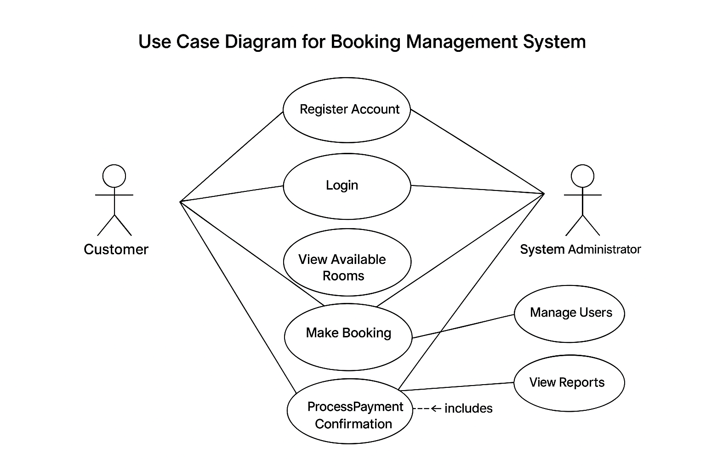

# Requirement Analysis in Software Development  

This repository documents the process of **Requirement Analysis** for a **Booking Management System**.  
It provides a structured overview of how software requirements are gathered, analyzed, documented, and validated to ensure a clear foundation for development.

---

## What is Requirement Analysis?  

**Requirement Analysis** is the process of identifying, gathering, and defining what a software system should do.  
It bridges the gap between stakeholders and developers by ensuring all functional and non-functional needs are clearly documented before design or implementation begins.  

In the **Software Development Life Cycle (SDLC)**, this phase ensures:  
- The system aligns with business goals.  
- Requirements are clear, consistent, and testable.  
- Development risks are minimized through early understanding.  

---

## Why is Requirement Analysis Important?  

1. **Clarity and Communication:**  
   Prevents misunderstandings between clients, users, and developers.  

2. **Cost and Time Efficiency:**  
   Early identification of issues reduces rework during development.  

3. **Project Success:**  
   Clear, validated requirements ensure the final product meets user expectations and business goals.  

---

## Key Activities in Requirement Analysis  

- **Requirement Gathering:** Collecting needs from stakeholders through interviews, surveys, and observations.  
- **Requirement Elicitation:** Understanding user expectations and translating them into system features.  
- **Requirement Documentation:** Recording requirements in clear, structured formats for all stakeholders.  
- **Requirement Analysis and Modeling:** Evaluating requirements for consistency and creating visual models like use case diagrams.  
- **Requirement Validation:** Reviewing and confirming that requirements meet business and user needs.  

---

## Types of Requirements  

### Functional Requirements  
Define what the system should do.  
**Examples (Booking Management System):**  
- Users can register, log in, and log out.  
- The system allows booking and cancellation of rooms.  
- Admins can manage available rooms and view booking reports.  

### Non-functional Requirements  
Define how the system performs its functions.  
**Examples:**  
- The system should respond to user actions within 2 seconds.  
- It must support up to 500 concurrent users.  
- The application should be available 99.9% of the time.  

---

## Use Case Diagrams  

**Use Case Diagrams** visually represent system interactions between **actors** (users or external systems) and **use cases** (system functions).  
They help identify all roles involved and the actions each can perform.  

**Benefits:**  
- Clarify system boundaries and user roles.  
- Simplify communication between stakeholders and developers.  
- Ensure all system functions are accounted for before design begins.  

**Actors:**  
- Customer  
- Admin  

**Use Cases:**  
- Create Booking  
- Cancel Booking  
- View Booking History  
- Manage Rooms  

  

---

## Acceptance Criteria  

**Acceptance Criteria** are predefined conditions that a feature must meet to be accepted by stakeholders.  
They ensure every requirement is testable, clear, and measurable.  

**Importance:**  
- Define when a feature is “done.”  
- Reduce ambiguity between teams.  
- Ensure alignment with user needs and business goals.  

**Example (Checkout Feature):**  
- The user must be able to select a room and view the total cost.  
- Payment confirmation must be displayed after successful transaction.  
- The system must send an email receipt to the user.  
- Booking details should be updated in the database immediately.  
